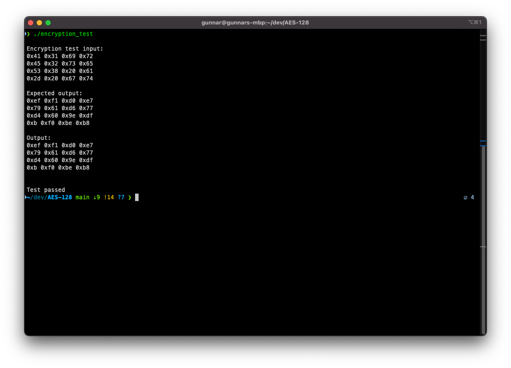
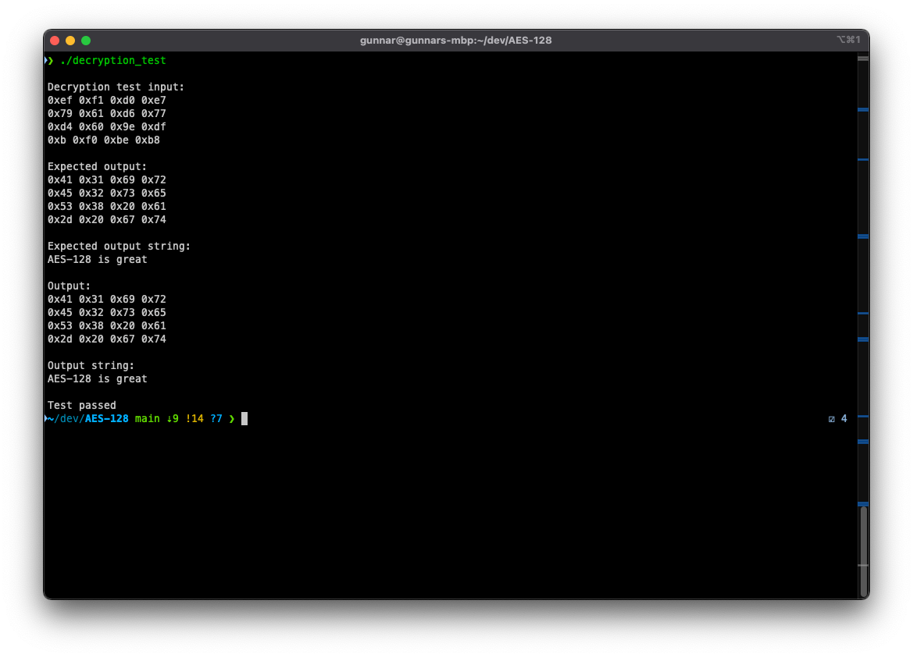
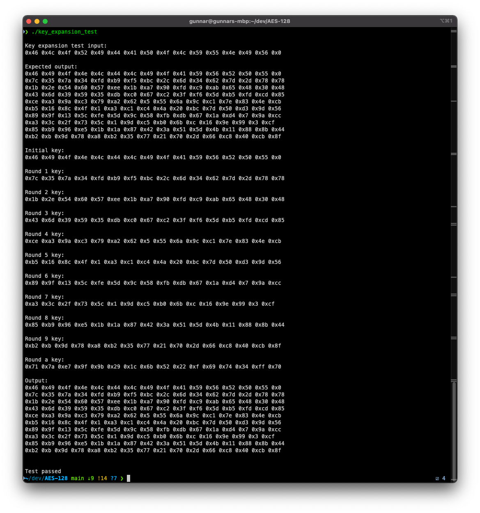

# AES-128

C++ implementation of 128-bit AES encryption and decription for CIS4362 - Applied Cryptography at Florida Poly in Spring of 2021. 

## Setup
1. Compile with ```g++ -c main.cpp src/aes_128_common.cpp src/aes_128_encrypt.cpp src/aes_128_decrypt.cpp src/aes_128_key_expansion.cpp encryption_driver.cpp decryption_driver.cpp key_expansion_driver.cpp```
2. Make main executable with ```g++ -o aes.o main.o aes_128_common.o aes_128_encrypt.o aes_128_decrypt.o aes_128_key_expansion.o```
3. Make encryption driver executable with ```g++ -o encryption_test aes_128_common.o aes_128_encrypt.o aes_128_decrypt.o aes_128_key_expansion.o encryption_driver.o```
4. Make decryption driver executable with ```g++ -o decryption_test aes_128_common.o aes_128_encrypt.o aes_128_decrypt.o aes_128_key_expansion.o decryption_driver.o```
5. Make key expansion driver executable with ```g++ -o key_expansion_test aes_128_common.o aes_128_encrypt.o aes_128_decrypt.o aes_128_key_expansion.o key_expansion_driver.o```

## Usage
* Run a test case that shows encryption and decryption with `./aes.o`
* Run the encryption test driver with `./encryption_test`
* Run the decryption test driver with `./decryption_test`
* Run the key expansion test driver with `./key_expansion_test`

## Screenshots
Output of encryption test:


Output of decryption test:



Output of key expansion test:


